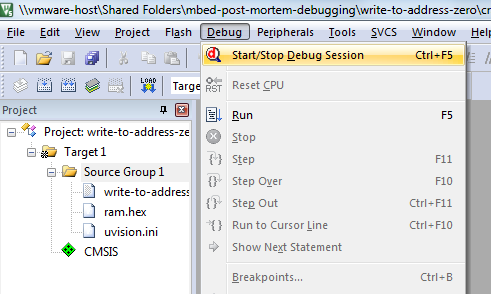
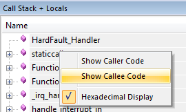
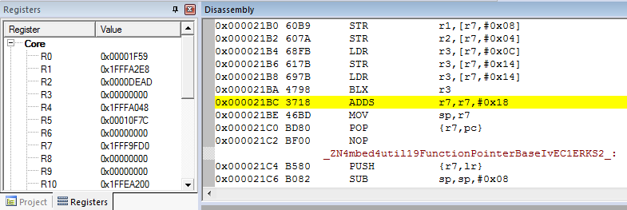

# Debugging a crashed device with CMSIS-DAP

When it comes to programming microcontrollers, the one scenario that you never want to face is a device that suddenly hangs. It's already very frustrating while you're developing software, and tracing down these bugs can be very time-consuming; it's even worse when the device is already deployed in the field. Replicating the exact conditions in which the device failed can be almost impossible in the lab, especially when the failure manifested itself months after deployment.

Fortunately mbed-enabled hardware ships with [CMSIS-DAP](https://developer.mbed.org/handbook/CMSIS-DAP) or its successor DAPLink, which allow you to directly hook into devices using the built-in USB ports (on developer boards), or a debugging probe like [SWDAP](https://developer.mbed.org/teams/mbed/wiki/SWDAP). CMSIS-DAP is responsible for mounting your mbed OS board as a mass-storage device for easy flashing, but it can also be used to dump the RAM and ROM of a running device, enabling you to do post-mortem debugging on a hanging device.

In this blog post we'll show you how to install all dependencies, crash a device, and subsequently do a post-mortem debug session. To follow along you'll need:

1. [A development board](https://www.mbed.com/en/development/hardware/boards/) capable of running mbed OS.
1. [yotta](http://yottadocs.mbed.com/#installing) - to build faulty firmware.
1. [ARM KEIL uVision 5](http://www2.keil.com/mdk5/install/) - to load the debug session. On OS X, run uVision in VMWare Fusion; it won't install in VirtualBox.
> **Note:** Unfortunately, you may not be able to run the debug session in an unlicensed version of uVision 5. This depends on the size of your RAM, because of the debugger's [32 Kbyte program limit](http://www.keil.com/demo/limits.asp).

1. Download [dump_firmware.py](https://github.com/janjongboom/mbed-post-mortem-debugging/blob/master/dump_firmware.py) - a Python script that dumps the RAM and ROM off a device, and sets up a uVision 5 project. Store this file in the same directory as your mbed OS project.


This article assumes knowledge of building applications for mbed OS. If you're unfamiliar with mbed OS, read [Running your first mbed OS application](https://docs.mbed.com/docs/getting-started-mbed-os/en/latest/FirstProjectmbedOS/) first.

## Creating a program that crashes

Here's an application that writes to a pointer at address 0x0 when the button at `SW2` is triggered. In most devices the ROM starts at address 0x0, and writing to ROM is not allowed, so the core hard faults:

```cpp
#include "mbed-drivers/mbed.h"

// change this to reflect a button on your own board
static InterruptIn btn(SW2);

static void blinky(void) {
    static DigitalOut led(LED1);
    led = !led;
}

static void btn_interrupt() {
    // this will crash your device!
    *(uint16_t*)0 = 0xDEAD;
}

void app_start(int, char**) {
    minar::Scheduler::postCallback(blinky).period(minar::milliseconds(500));

    btn.fall(&btn_interrupt);
}
```

Build this application with debug symbols enabled (use `yt build -d`) and flash it on your device. The LED should start blinking. Press `SW2` and the device freezes.

### Starting a post-mortem debug session

Now we can put the [dump_firmware.py](https://github.com/janjongboom/mbed-post-mortem-debugging/blob/master/dump_firmware.py) Python script to good use. Run the script with the crashed device plugged in:

**Note:** If you’re using virtualenv to run yotta, run this script in the same virtualenv environment. On Windows, run this script from 'Run yotta' in your start menu.

```bash
write-to-address-zero $ python dump_firmware.py
[1/6] Using build directory 'build/frdm-k64f-gcc/source/', verifying build...
[2/6] Build verified. Connecting to board...
[3/6] Board recognized as k64f. Downloading ROM...
[4/6] Dumped ROM. Downloading RAM...
[5/6] Dumped RAM. Creating uVision project...
[6/6] Done. Open 'crashdump/write-to-address-zero.uvprojx' in uVision 5 to debug.
```

A crashdump folder is created. It contains debug symbols, the RAM and ROM of the device, and a uVision 5 project file. Double click on the project file to open uVision.

### Loading the session in uVision 5

In uVision, choose 'Debug > Start/Stop Debug Session' to start.




In the Disassembly panel we see that we're in the `HardFault_Handler`, which is expected. We can drill down into the stack by selecting 'Debug > Step'.


Now we get more information about the state of the application. On the right bottom corner we see the Call Stack that led up to the crash. We can see we passed an interrupt on a GPIO port (`gpio_irqC`), going through an interrupt in handler (`handle_interrupt_in`), and then through a function pointer with zero arguments and return type `void` (`FunctionPointer0<void>`). Although this does not point us straight at the name of the calling function, it helps us pinpoint which functions in our application could be the culprit.


Let's look at some assembly. In the Call Stack panel, right click on 'staticcaller', and select 'Show Callee Code'.




We now jump into the disassembled source. In some cases, you’re lucky enough to jump straight into the function that crashed. Not this time; apparently the function managed to return before the hard fault happened, which we know because straight before the crash we see a function call:

```
LDR           r3,[r7,#0x14]   // Load word from memory
BLX           r3              // Branch with Link
```




The value of R7,#0x14 (0x1fff9fd0 + 0x14), therefore points to the address of the actual call that was just made. Open a new watch window, using 'View > Watch Windows > Watch 1', to find out which function was called. Add a watch to `(void*)(0x1FFF9fd0 + 0x14)` in the watch window, and inspect the value of the pointer (in this case `0x1f59`).


We can now navigate to this value in the disassembly window, and…


We found our function! We're trying to store the value of R2 (`0xDEAD`) in R3 (`0x0`).

## Never-ending loops

This approach can be used for more than just debugging hard faults. We can also use it when a device hangs because it entered a never-terminating loop. Let's look at the following code:

```cpp
#include "mbed-drivers/mbed.h"

static void my_loop_function(void) {
    uint8_t turns = 20;

    while(turns-- > -1) {
        wait_ms(5);
    }
}

void app_start(int, char**) {
    minar::Scheduler::postCallback(my_loop_function).delay(minar::milliseconds(500));
}
```

Here `turns-- > -1` will always be true (because turns is a `uint8_t`), so the device will never exit the loop. When we start a post-mortem debug session, we can immediately see the function that we are currently stuck in.


## Conclusion

CMSIS-DAP on ARM mbed OS can be a tremendous help with hard to find issues. The ability to recover a crashed device from the field, and use post-mortem debugging on it, is a great addition to the toolchain of every developer.

To replicate the tests we used in this article, take a look at [mbed-post-mortem-debugging on GitHub](https://github.com/janjongboom/mbed-post-mortem-debugging). You'll find the Python script and all source code used in this article. Happy disassembling!

---

*This article was written by [Russ Butler](https://github.com/c1728p9) (Embedded Software Engineer working on DAPLink and pyOCD) and [Jan Jongboom](https://twitter.com/janjongboom) (Developer Evangelist IoT).*
